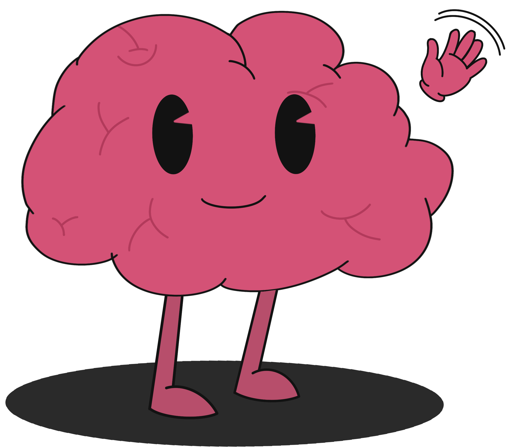

<div align="center">
  
</div>

<div align="center">
  <h1>Hey there! Welcome to Brainy's Dashboard! 🎮</h1>
</div>

Welcome to my command center! I'm the dashboard that helps manage all the amazing content and users in the Brainy universe! Think of me as the control panel where all the magic happens! ✨

## What I Can Do! 🚀

### For Content Creators 🎨

- Create and share amazing new content with the Brainy community!
- See how your content is performing with cool stats and insights
- Track which of your notes are waiting to be validated
- Get inspired by seeing what topics are trending!

### For Moderators 🛡️

- Review and validate new content to keep the quality top-notch!
- Make sure everything follows our community guidelines
- Help creators improve their content with feedback
- Keep the content flow smooth and organized

### For Administrators 👑

- Have a bird's eye view of the entire Brainy universe
- Manage users and content with superpowers
- Keep everything running smoothly
- Make important decisions based on real-time data

### For Everyone! 📊

I love showing off cool stats! Here's what you can see:

- How many friends (users) we have in total
- How many creative minds (creators) are sharing knowledge
- Total number of notes in the Brainy universe
- What topics are getting the most attention
- Which notes are waiting for validation
- Who's creating the most amazing content

## My Tech Superpowers! 💪

I'm built with some pretty cool stuff:

- React (my interactive brain)
- TypeScript (my type-safe thoughts)
- Vite (my super-fast development environment)
- [More tech details coming soon!]

## Let's Get Started! 🎮

### What You'll Need 📦

- Node.js (my runtime environment)
- npm or yarn (my package manager)
- A modern web browser (to see me in action!)

### Setting Me Up 🛠️

1. First, clone my repository:

```bash
git clone [repository-url]
```

2. Go to the project directory:

```bash
cd brainy-dashboard
```

3. Install my dependencies:

```bash
npm install
```

4. Start me up:

```bash
npm run dev
```

And voilà! I'll be running on your local machine, ready to help manage the Brainy universe!

## Want to Help 🤝?

I'd love to have more friends help make me even better! Guidelines coming soon!

For the moment you can contact my dad for creating content or building new features!

## Need to Chat? 📱

Got questions or ideas? Reach out to my creator:

- Email 📧: [letanter.andreas@orange.fr](letanter.andreas@orange.fr)
- GitHub 📱: [AndreasLetanter](https://github.com/AndreasLetanter)
- Instagram 📸: [andreas.letanter](https://www.instagram.com/andreas_le_tanter/)
- LinkedIn 📧: [Andreas Letanter](www.linkedin.com/in/andréasletanter)

## Special Shoutout to My Design Journey! 🎨

All the designs you see here (including my cute face!) were created with Procreate on iPad. While I'm not a professional designer, I did my best to make Brainy look friendly and approachable. If you're a designer and would like to help improve Brainy's look or the overall app design, I'd love to collaborate! Feel free to reach out using any of the contact methods.

_Note: I intentionally chose not to use AI for Brainy's design out of deep respect for the incredible work of human designers. While AI can create amazing designs, I believe in supporting the unique creativity and expertise of human designers 🎨_

## Legal Stuff 📝

License information coming soon! (But don't worry, I'm friendly and open-source!)
